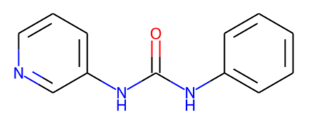
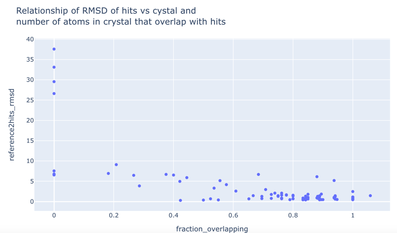
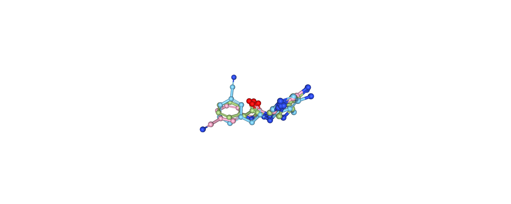

## Moonshot

The manual filtering of the moonshot data is described
[here](https://github.com/matteoferla/Fragmenstein/blob/master/documentation/notes/manual_filtering.md).

## x0434
The prolific hit x0434 is rather troublesome as it is quasi symmetric.


The pyridine ring forms a hydrogen bond to the protein, so luckily
the followups with a pyridine ring will bind that way
however Fragmenstein may be misled: in which case there will be a 7+ Å RMSD
between the Fragmenstein placement and the crystal structure.

For example, EDJ-MED-49816e9b-1 (x11011) was said to be a merger of x0434 and x0678,
but the latter is a red-herring and the superposition of the two fragments results
in Fragmenstein assigning the methyl substituent based on the other ring.

For testing (and classification) I have made two variants of x0434,
where the ureido is substituted by an amide on other side.

```python
from fragmenstein import Monster, mpro_data
x0434 = mpro_data.get_mol('x0434')
monster = Monster([x0434])
smiles = 'O=C(Nc1ccccc1)Cc1cccnc1'
monster.place_smiles(smiles, long_name='x0434-pyri')
x0434_pyri = monster.positioned_mol

smiles = 'O=C(Cc1ccccc1)Nc1cccnc1'
monster.place_smiles(smiles, long_name='x0434-benzo')
x0434_benzo = monster.positioned_mol
monster.to_nglview()
```

However, for the analysis I did not use these,
bar for minor tests... to discover that the couple of outliers are
a case of flipped mapping.


```python
import pandas as pd

data = pd.read_csv('mpro_manual.csv')

from fragmenstein import MProVictor, mpro_data, Igor

Igor.init_pyrosetta()
results = {}
bad = []

for i, row in data.iterrows():
    cid = row.cid
    if cid in bad:
        continue
    if cid in results:
        continue
    print(cid)
    try:
        victor = MProVictor.from_hit_codes(row.inspiration_hits.split(','), category=row.category)
        smiles = mpro_data.get_mol(row.crystal)
        victor.place(row.SMILES, 
                     long_name=row.cid,
                    )
        results[cid] = {**victor.validate(mpro_data.get_mol(row.crystal)),
                        **victor.summarize()}
    except Exception as error:
        print(error)
        bad.append(cid)

# ## parse results
# Unfortunately I overrode a variable with a different type!
results = pd.DataFrame(results).transpose()
results.to_pickle('filtered_moonshot.p')
results
```

## Overlapping

The RMSD of hit to crystal depends on a mapping
which could be wrong.
As a results a further metric is used:
```python
from fragmenstein.monster import GPM

def calc_fraction_overlapping(followup, hits) -> int:
    mapped = {k for hit in hits for k in GPM.get_positional_mapping(followup, hit).keys()}
    return len(mapped)/ followup.GetNumHeavyAtoms()

def clean_name(name):
    return name.replace('_benzo', '').replace('_pyri', '')

def row2overlap(row):
    followup = mpro_data.get_mol(row.crystal_code)
    hit_names = map(clean_name, row.regarded)
    hits = map(mpro_data.get_mol, hit_names)
    return calc_fraction_overlapping(followup, hits)

results['fraction_overlapping'] = results.apply(row2overlap, axis=1)
```
As expecting RMSD and overlap is flat in the high overlap range,
but is bad when the overlap is poor.


This is because several followups are not quite followups and
some bound in a different location than anticipated.

## rDock

Rubén (@rsanchezgarc)  did the rDock analysis of the moonshot data.

Parsing of the sdf file given:

```python
from rdkit.Chem import PandasTools

rdock = PandasTools.LoadSDF('rdock_vs_fragmenstein_summary.sdf', 
                            embedProps=True,
                            molColName='mol', smilesName='smiles')

free_top1 = {}
free_top10 = {}
pharm_top1 = {}
pharm_top10 = {}
old = {}

rdock['SCORE'] = rdock.SCORE.astype(float)
rdock['docking_RMSD'] = rdock.docking_RMSD.astype(float)

for name, named_dock in rdock.groupby('name'):
    nega_mask = named_dock.SCORE < 0
    free = named_dock.loc[(named_dock.docking_type == 'freedocking') & nega_mask]\
                     .sort_values('SCORE')
    pharm = named_dock.loc[(named_dock.docking_type == 'pharm4constrdocking')  & nega_mask]\
                     .sort_values('SCORE')
    free_top1[name] = free.head(1).docking_RMSD.min()
    free_top10[name] = free.head(10).docking_RMSD.min()
    pharm_top1[name] = pharm.head(1).docking_RMSD.min()
    pharm_top10[name] = pharm.head(10).docking_RMSD.min()
    old[name] = free.head(1).fragmenstein_minimised_RMSD.astype(float).min()

# Add to `results`
index_series = results.index.to_series()  # actually this is the same as results['name']
results['rdock_free'] = index_series.map( free_top1 )
results['rdock_free_top10'] = index_series.map( free_top10 )
results['rdock_pharm'] = index_series.map( pharm_top1 )
results['rdock_pharm_top10'] = index_series.map( pharm_top10 )
results['old_RMSD'] = index_series.map( old )
```

## Figure
```python
import plotly.express as px
fig = px.scatter(results.loc[(results.fraction_overlapping > 0.1) & (results['∆∆G'] <= 0)], # 
                 y='reference2minimized_rmsd', 
                 x='rdock_free', 
                 color='fraction_overlapping',
                 color_continuous_scale='Bluered_r',
                 hover_data=['name'],
                 #symbol='based_on_x0434',
                 title='RMSD of Fragmenstein vs. rDock (free)',
                 width=600, height=600
                )
fig.add_shape(type="line",
    x0=0, y0=0, x1=10, y1=10,
    line=dict(
        color="gainsboro",
        width=2,
        dash="dot",
    )
)


fig.update_shapes(dict(xref='x', yref='y'))
fig.add_hrect(y0=0, y1=1, line_width=0, fillcolor="#AED882", opacity=1, layer='below')
fig.add_vrect(x0=0, x1=1, line_width=0, fillcolor="#AED882", opacity=1, layer='below')
fig.update_layout(paper_bgcolor='white', 
                  plot_bgcolor='white',
                 yaxis=dict(gridcolor='gainsboro', 
                            linecolor='darkgrey',
                            title='Fragmenstein RMSD [Å]',
                            range=(0, 10)
                           ),
                 xaxis=dict(gridcolor='gainsboro',
                            linecolor='darkgrey',
                            title='rDock (free) RMSD [Å]',
                            range=(0, 10)
                           ),
                  #legend=dict(orientation='h'),
                  coloraxis_colorbar=dict(title='Fraction of <br>followup atoms <br>overlapping <br>hit atoms')
                 )
#fig.layout.coloraxis.colorbar.orientation='h'
fig.write_image("free.png")
fig.write_image("free.svg")
fig
```

### Odd ones

JOR-UNI-2fc98d0b-12 (88% overlap) gets mapped incorrectly:


The compound is a triskelion of three rings, cyclo-hexane, pyridine and chlorobenzene.
Fragmenstein maps the pyridine with the pyridine of x0434 as I believe was the submitter's intention.
In effect this is binding unexpectedly.

MAK-UNK-6435e6c2-4 (97%) is a covalant, but the warhead was not picked up as its SMILES was submitted
without it.
Namely it should have been `*CC(=O)Nc1cccc(N2CCCC2=O)c1` —or `[Cl]CC(=O)Nc1cccc(N2CCCC2=O)c1` and
flagged as covalent.


ANN-UNI-26382800-5 (100%) is an interesting case as Fragmenstein maps as I would have expected,
but the ligand crystallised differently.


DAR-DIA-23aa0b97-20 (85%) gets mapped as expected, but crystallised at a different orientation.
A thing to note is that the ∆∆G of the Fragmenstein placement is only -0.6 kcal/mol, so
a scraping pass.


TRY-UNI-714a760b-19 (85%) has a novel bit (actually not, but x1382 was not declared as inspired),
that gets placed wrong.



BAR-COM-4e090d3a-49 (<80%) adds a new bit and changes one ring into another again on x0434.


BAR-COM-4e090d3a-47 (<80%) is a triskelion and Fragmenstein maps as I would have expected,
but it bound differently.


TRY-UNI-2eddb1ff-2 (<80%) is another case of weird unexpected binding from a bizarre inspiration set.


etc. etc.

Looking at these compounds it is clear that the user's intentions were cryptic in some cases,
or the followup bound differently. This is expected and a compound that binds differently is
likely a worse binder, especially due to strain as DAR-DIA-23aa0b97-20 shows.
The dataset is very dirty and in some cases the compounds were generated via some algorithm,
such as BRICS decomposition (which is agnostic of original connectivity), yielding compounds
that are unlikely to map as expected.
In other words, I was hoping to go through the top outliers and map them semi-manually
to re-iterate the user interaction aspect, but I couldn't make sense of the suggestions.
